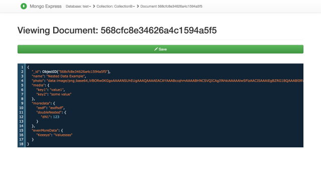
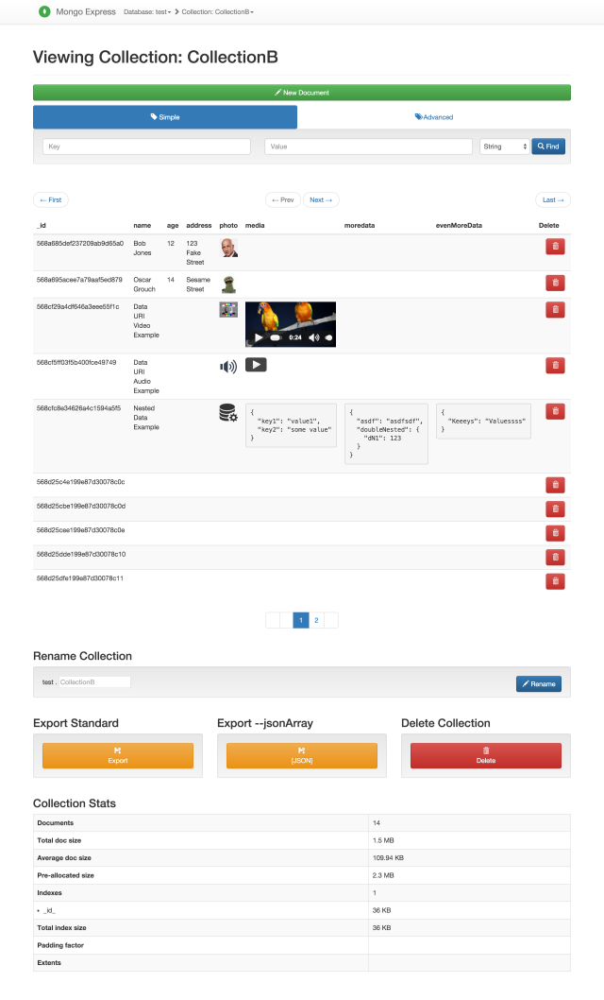
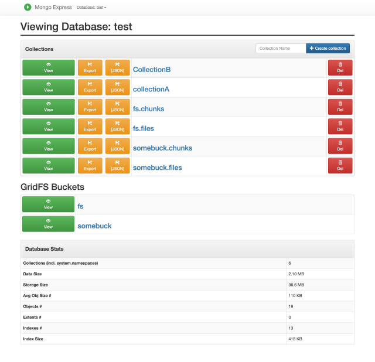

<!--
N.B.: This README was automatically generated by https://github.com/YunoHost/apps/tree/master/tools/README-generator
It shall NOT be edited by hand.
-->

# Mongo Express for YunoHost

[](https://dash.yunohost.org/appci/app/mongo-express)    
[](https://install-app.yunohost.org/?app=mongo-express)

*[Lire ce readme en français.](./README_fr.md)*

> *This package allows you to install Mongo Express quickly and simply on a YunoHost server.
If you don't have YunoHost, please consult [the guide](https://yunohost.org/#/install) to learn how to install it.*

## Overview

Mongo Express is a Web-based MongoDB admin interface written with Node.js, Express and Bootstrap3.
You can as well install a Mongo database - version 4, 5 or 6 in your yunohost server if you want 

### Features
- Optionally installs Mongo server
- Connect to multiple databases
- View/add/delete databases
- View/add/rename/delete collections
- View/add/update/delete documents
- Preview audio/video/image assets inline in collection view
- Nested and/or large objects are collapsible for easy overview
- Async on-demand loading of big document properties (>100KB default) to keep collection view fast
- GridFS support - add/get/delete incredibly large files
- Use BSON data types in documents
- Mobile / Responsive - Bootstrap 3 works passably on small screens when you're in a bind
- Connect and authenticate to individual databases
- Authenticate as admin to view all databases
- Database blacklist/whitelist
- Custom CA and CA validation disabling
- Supports replica sets


**Shipped version:** 1.0~ynh3

## Screenshots





## Disclaimers / important information

* For now, any user that can log to your server will have admin access to all your Mongo databases !
    * Single-sign on or LDAP are not integrated
    * It's strongly recommanded you don't enable public access to the application

* It doesn't backup Mongo databases
    * As mongo-express doesn't require any database by itself, it doesn't backup or restore any of them
    * However, yYou can view / edit other applications databases with Mongo-Express
    * It will just reinstall the Mongo server if you installed it with this script 
    * Any yunohost applications using Mongo databases should manage the backup and restore

## Documentation and resources

* Upstream app code repository: <https://github.com/mongo-express/mongo-express>
* YunoHost documentation for this app: <https://yunohost.org/app_mongo-express>
* Report a bug: <https://github.com/YunoHost-Apps/mongo-express_ynh/issues>

## Developer info

Please send your pull request to the [testing branch](https://github.com/YunoHost-Apps/mongo-express_ynh/tree/testing).

To try the testing branch, please proceed like that.

``` bash
sudo yunohost app install https://github.com/YunoHost-Apps/mongo-express_ynh/tree/testing --debug
or
sudo yunohost app upgrade mongo-express -u https://github.com/YunoHost-Apps/mongo-express_ynh/tree/testing --debug
```

**More info regarding app packaging:** <https://yunohost.org/packaging_apps>
